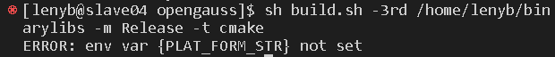

# DcfFrameworkDemo

## 框架介绍
To be continue...

## 编译和运行
在运行本项目之前需要编译[Distributed Consensus Framework](https://gitee.com/opengauss/DCF),编译成功后，把编译生成的动态链接库复制到当前目录下的lib文件夹下。
### DCF框架的编译
DCF是openGauss开发的一款一致性框架。具体的编译方式详见[Distributed Consensus Framework](https://gitee.com/opengauss/DCF)

DCF编译具体步骤：

1. `cd build/linux/opengauss/`
2. `sh build.sh -3rd [binarylibs path] -m Release -t cmake ` 

- 这里的`[binarylibs path]`可以是自己下载的`binarylibs`的路径 如果在服务器上 则可以直接利用data目录下的库第三方库，具体路径为:

> `/data/toolchain/binarylibs`

如果执行后发现有如下报错：

执行:
> export PLAT_FORM_STR=\`sh get_platform_str.sh\` 

编译成功如图显示：

编译成功后的动态链接库生成在`DCF/output/lib`下，如果修改DCF源码，重新编译只需执行`make`即可
### DcfFrameworkDemo框架的运行
1. 设置目录下的`DcfFrameworkDemoConfig.json`.
2. 关闭目标机器的防火墙
3. 执行该文件夹下的build.sh脚本即可运行。
