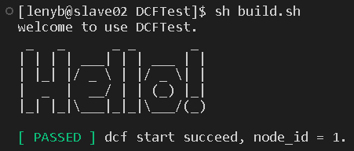

# DCFTest: 分布式一致性框架的测试工具
&#160; &#160; &#160; &#160; CFTest基于GitHub上的项目DCF-Demo，作者是我的师兄。我们希望通过设计DCF测试程序来验证DCF的可用性与性能，便于后期和其他的分布式项目对接。

DCF-Demo项目地址：https://github.com/NPUWDBLab/DCF-Demo

DCFTest实现了基于DCF的下列测试情景:
 * **读写测试**: DCFTest在程序内部提供了交互窗口，允许用户通过FCFTest所支持的读写指令对DCF进行读写数据。在不同的集群情境下，测试跨可用区的多副本复制。
 * **集群故障测试**: DCF作为稳定可靠的一致性数据复制组件，为了测试DCF在任何条件下的可用性，DCFTest提供了可以模拟多种集群故障情况的指令。通过不同的指令组合，用户可以测试DCF在节点宕机、网络分区等情况下的可用性情况。
 * **集群变更测试**: DCFTest可以通过指令组合，实现集群节点与配置的动态变更。用以对容灾性自动与手动升降主备，集群状态查询，集群配置管理情景的测试。

---

## 1. 外部依赖关系

&#160; &#160; &#160; &#160; 在运行DCFTest之前，需要确保安装配置好了下面列出的依赖项。
* DCF 3.1.0 
* gcc 4.8.5

## 2. 配置

* 将DCFTest安装到本地
```javascript
# clone DCFTest to local
[lenyb@slave02 DCFTest]$ git clone https://github.com/lamber1123/DCFTest.git
```
* 修改“DCFTest/DCFTestConfig.json”中的集群配置，将各集群节点对应的node_id、IP与port字段进行修改
```javascript
# set the node_id, IP and port
[lenyb@slave02 DCFTest]$ vim DCFTestConfig.json
```
* 设置环境变量，将LD_LIBRARY_PATH设置为DCF生成的lib库路径
```javascript
# set environment variable
[lenyb@slave02 DCFTest]$ export LD_LIBRARY_PATH=//data/toolchain/lib::$LD_LIBRARY_PATH
```

## 3. 运行

**所有节点所在的服务器上均要配置DCFTest**
* 运行build.sh以启动DCF
```javascript
# run DCFTest
[lenyb@slave02 DCFTest]$ sh build.sh
```



## 4. 使用方法

* 在终端交互窗口中输入指令
* 如果提示PASSED，代表操作成功，如果提示FAILED，则代表操作失败
* 输入错误的指令或输入空指令后，会对程序支持的指令进行提示

**至此，DCFTest已经部署完成**

## 5. 测试

&#160; &#160; &#160; &#160; 详细的测试过程将在<a href="https://lamber1123.github.io/2022/12/07/DCFTest%EF%BC%9ADCF%E6%B5%8B%E8%AF%95%E6%A1%86%E6%9E%B6%E7%9A%84%E8%AE%BE%E8%AE%A1/">《DCFTest：DCF测试框架的设计》</a>中记录。

